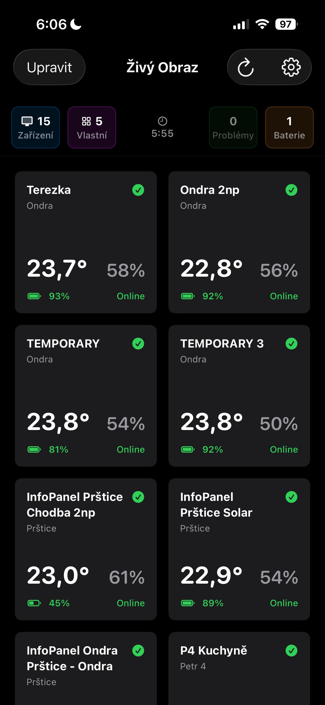
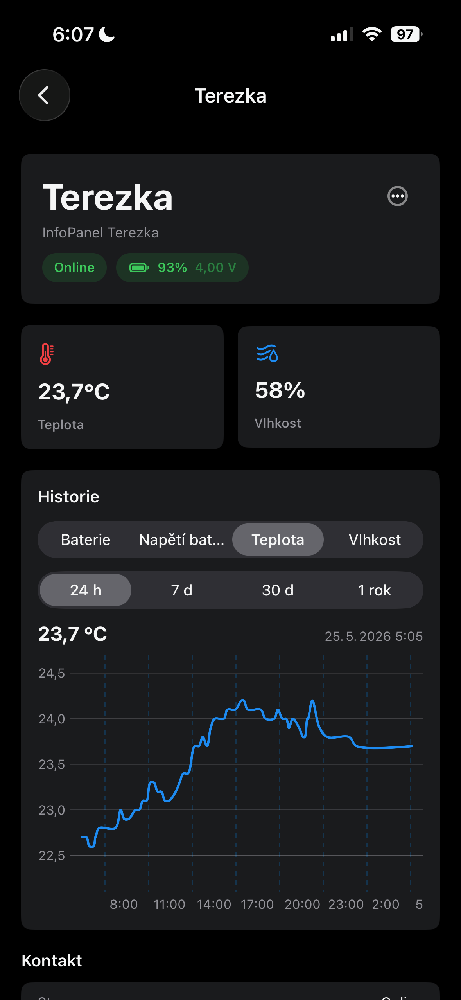
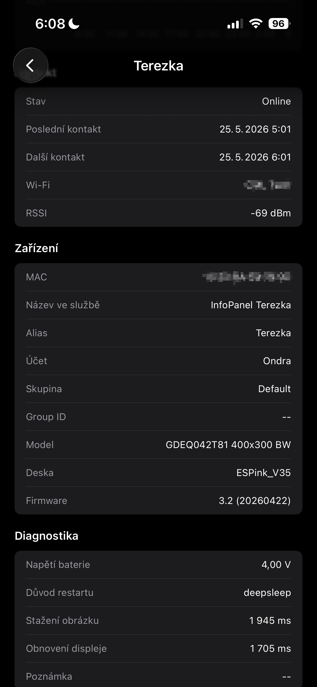
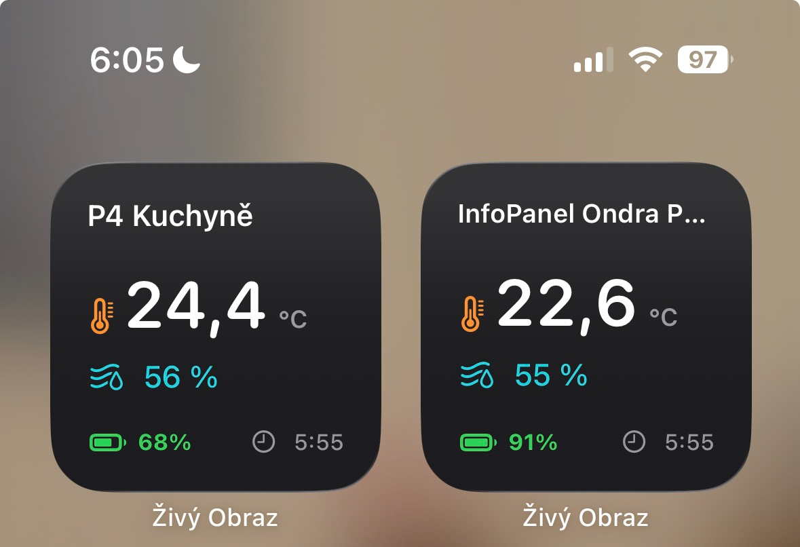
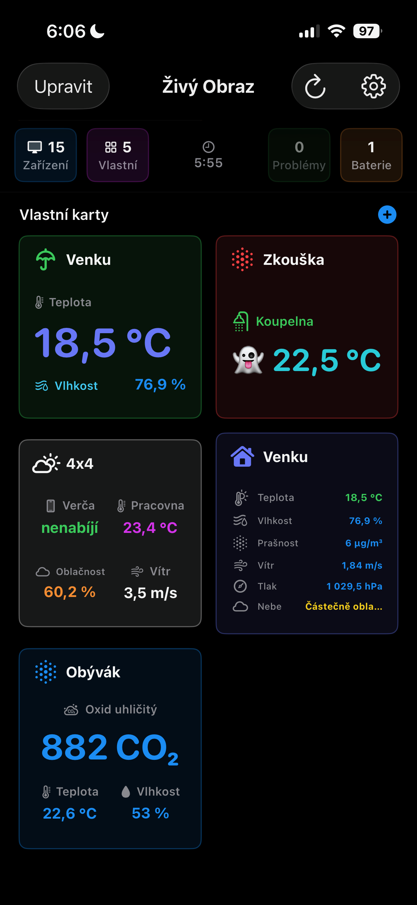
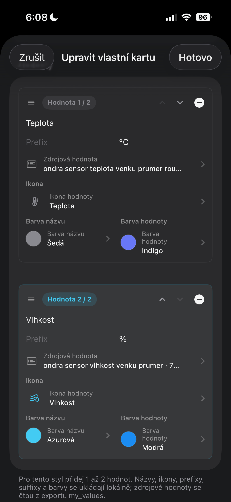
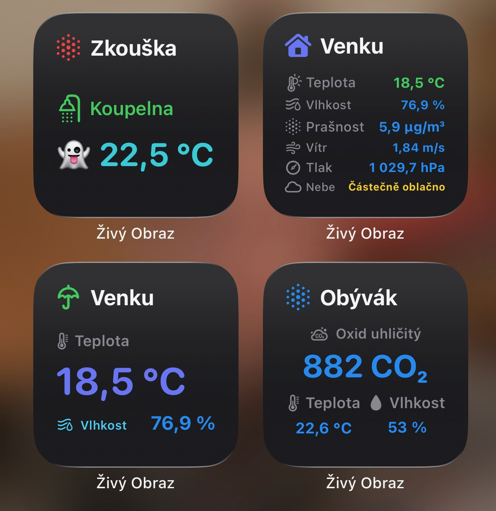
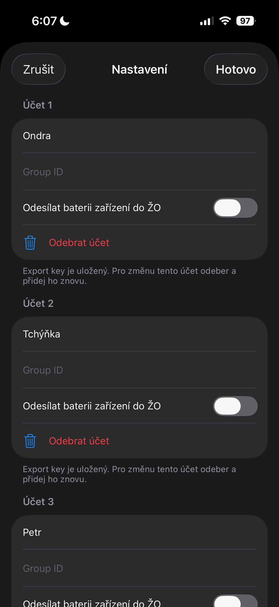

# Živý Obraz pro iOS

[English version](README.en.md)

Jednoduchá iOS aplikace pro rychlý přehled zařízení ze služby [**Živý Obraz**](https://zivyobraz.eu/?page=o-sluzbe). Na iPhonu nebo iPadu uvidíš stav svých e-paperů, naměřené hodnoty, baterii, historii i widgety přímo na ploše.

## Veřejné testování přes TestFlight

Aplikace je dostupná k veřejnému testování přes oficiální Apple TestFlight. **Před kliknutím na odkaz si z App Store doinstaluj aplikaci TestFlight od Apple. Odkaz poté otevří přímo z iOS zařízení pro automatické propojení s TestFlight.**

Testovací verze může obsahovat chyby nebo nedodělané chování. Když vyjde nová testovací verze, TestFlight tě na ni upozorní a nabídne aktualizaci, případně může být povolena automatická aktualizace.

**[Připojit se k testování](https://testflight.apple.com/join/D6CzKtCZ)**

## Hlavní funkce

- **Přehled všech zařízení** - teplota, vlhkost, baterie, online stav a rychlé filtrování problémů.
- **Lokální upozornění na stav e-paperů** - oznámení a odznak aplikace pro nově zpožděná zařízení, návrat do normálu a baterii pod 20 %.
- **Widgety na plochu iPhonu i iPadu** - vyber konkrétní e-paper a sleduj jeho hodnoty bez otevírání aplikace.
- **Vlastní widgety pro libovolné hodnoty** - poskládej si vlastní kartu z jakékoli hodnoty dostupné v exportu služby Živý Obraz.
- **Automatická aktualizace dat** - aplikace ukládá data pro widgety a obnovuje je na pozadí podle možností iOS.
- **Detail zařízení** - informace o signálu, baterii, firmwaru, posledním kontaktu a historii měření.
- **Více účtů a skupin** - můžeš přidat více exportních klíčů a volitelně filtrovat zařízení podle Group ID.
- **Úprava dashboardu** - vlastní aliasy, řazení zařízení a skrytí nepoužívaných e-paperů.
- **Volitelná synchronizace přes iCloud** - sdílení nastavení mezi zařízeními a volitelná záloha historie grafů.
- **Volitelné odesílání baterie zařízení** - baterii iOS zařízení lze posílat zpět do Živého Obrazu přes importní API.
- **Automatizace přes Zkratky** - akce pro iOS Zkratky umí odeslat stav zařízení nebo vlastní hodnoty senzorů.

## Ukázky aplikace

### Přehled zařízení

Dashboard ukazuje e-papery v přehledných kartách. Rychle vidíš, která zařízení jsou online, jakou mají baterii a jaké hodnoty právě měří.

  
  
  

### Widgety na ploše

Klasické widgety zobrazují konkrétní e-paper přímo na ploše iPhonu nebo iPadu. Po prvním načtení dat v aplikaci stačí widget přidat na plochu a vybrat zařízení.

  

### Vlastní widgety

Vlastní widgety jsou určené pro hodnoty z exportu služby Živý Obraz. Můžeš si vytvořit kartu pro jednu dominantní hodnotu, dvě nebo tři hodnoty, případně seznam více hodnot.

  
  

  

### Nastavení aplikace

V nastavení se přidávají účty, exportní klíče, volitelné Group ID, lokální upozornění a importní API pro odesílání baterie zařízení.

  

## Jak aplikaci nastavit

### 1. Připrav si exportní klíč

Ve službě Živý Obraz si připrav **exportní klíč**. Aplikace ho používá pro načítání zařízení a hodnot.

Pokud chceš zobrazovat jen vybranou skupinu zařízení, připrav si také **Group ID**. Tento krok je volitelný.

### 2. Přidej účet v aplikaci

1. Otevři aplikaci Živý Obraz.
2. Klepni na ikonu nastavení.
3. Vyplň název účtu.
4. Vlož exportní klíč.
5. Volitelně vyplň Group ID.
6. Ulož nastavení tlačítkem **Hotovo**.

Po uložení aplikace načte zařízení a uloží data pro widgety.

### 3. Přidej widget na plochu

1. Na ploše iPhonu nebo iPadu podrž prst na volném místě.
2. Klepni na **Upravit**, zvol přidat widget a vyhledej **Živý Obraz**.
3. Vyber velikost widgetu.
4. Po přidání na widgetu podrž prstem a zvol **Upravit widget**.
5. Vyber konkrétní zařízení nebo ponech automatický výběr.

Widget používá poslední načtená data a průběžně se aktualizuje podle možností iOS.

### 4. Vytvoř vlastní widget

1. V aplikaci přepni na část **Vlastní**.
2. Klepni na přidání vlastní karty.
3. Vyber hodnoty z exportu služby Živý Obraz.
4. Zvol rozložení karty a vzhled.
5. Přidej na plochu widget **Živý Obraz Custom** a vyber vytvořenou kartu stejným způsobem jako pro widget zařízení v bodě 3.

Vlastní widget je vhodný například pro venkovní teplotu, vlhkost, tlak, CO2, kvalitu vzduchu, stav baterie nebo jakoukoli další hodnotu, kterou máš v exportu.

## Lokální upozornění na stav e-paperů

Aplikace umí posílat lokální iOS upozornění, když se některý e-paper dostane do problémového stavu nebo se z něj vrátí zpět. Nastavení upozornění je ve výchozím stavu zapnuté, ale iOS oznámení zobrazí až po udělení oprávnění pro aplikaci Živý Obraz.

Aplikace upozorní na:

- nově zpožděný e-paper, který se dlouho neozval,
- návrat zařízení zpět do normálního stavu,
- pokles baterie zařízení pod 20 %.

Při ručním, foreground i background refreshi si aplikace ukládá poslední známý stav zařízení, aby stejné upozornění neposílala opakovaně. Podle aktuálních problémů zařízení aktualizuje také odznak aplikace na ploše iOS.

Lokální upozornění můžeš vypnout v nastavení aplikace. Pokud oprávnění k oznámením v iOS odmítneš nebo později vypneš, aplikace dál zobrazuje stav zařízení v dashboardu a widgetech, ale systémová oznámení a odznaky nemusí být dostupné.

## Synchronizace přes iCloud

Aplikace může používat iCloud pro synchronizaci nastavení mezi zařízeními a volitelně také pro zálohu databáze s historií hodnot pro grafy.

Cloud není povinný. Aplikace funguje i čistě lokálně v jednom zařízení.

### Co znamená „Synchronizovat nastavení přes iCloud“

Po zapnutí synchronizace se přes iCloud sdílí hlavně nastavení aplikace, například:

- nastavení účtů a zařízení,
- aliasy zařízení,
- pořadí a skrytí karet na hlavní obrazovce,
- sdílené vlastní karty,
- seznam zařízení, která synchronizaci používají,
- čas posledního refreshnutí dat na jednotlivých zařízeních.

Exportní a importní klíče se ukládají přes iCloud Klíčenku Apple, aby byly dostupné i na dalších zařízeních přihlášených ke stejnému Apple ID.

Historie hodnot pro grafy není součástí běžné synchronizace nastavení. Ta má vlastní samostatnou volbu pro zálohu databáze.

### Zapnutí synchronizace

Při zapnutí synchronizace aplikace zkontroluje, jestli už v iCloudu existuje uložená konfigurace.

Pokud v iCloudu zatím žádná konfigurace není, aplikace nabídne použití aktuálního nastavení tohoto zařízení jako výchozí konfigurace pro ostatní zařízení. Když potom zapneš synchronizaci na dalším zařízení, převezme se právě toto nastavení.

Pokud už v iCloudu konfigurace existuje, aplikace upozorní, že lokální nastavení v zařízení bude nahrazeno nastavením z iCloudu.

### Záloha historie grafů

Historie grafů je uložená v lokální databázi v zařízení. Tuto databázi je možné volitelně zálohovat do iCloudu.

Záloha databáze je samostatná funkce. Můžeš si vybrat, jestli chceš databázi do cloudu ukládat, nebo jestli ji ponecháš pouze lokálně v zařízení.

Když je záloha databáze zapnutá, aplikace ji ukládá na pozadí. Automatická záloha se nespouští neustále, ale nejvýše přibližně jednou za 4 hodiny, když má aplikace příležitost zálohu provést. Poslední čas zálohy je vidět v nastavení.

Zálohu je možné spustit také ručně.

### Obnova databáze z iCloudu

Pokud aplikaci nainstaluješ znovu a lokální databáze je prázdná, aplikace může obnovit historii grafů ze zálohy v iCloudu.

Pokud už ale v zařízení nějaká lokální databáze existuje, aplikace ji bez dotazu nepřepíše. V takové situaci se zeptá, jestli chceš lokální databázi nahradit databází z iCloudu, nebo ponechat aktuální lokální data.

V dialogu obnovy je zobrazené také datum cloudové zálohy, aby bylo jasné, ze kdy záloha pochází.

### Když databázi do cloudu nechceš ukládat

Zálohu databáze do iCloudu je možné vypnout.

Po vypnutí se cloudová záloha databáze smaže. Totéž se stane i v případě, že při zapnutí iCloudu zvolíš možnost ponechat databázi pouze lokálně.

Nastavení aplikace se může dál synchronizovat přes iCloud, ale historie grafů zůstane jen v daném zařízení.

### Vypnutí iCloudu

Při vypnutí cloudové synchronizace se aplikace pokusí ještě naposledy odeslat aktuální zálohu databáze do iCloudu, pokud je záloha databáze zapnutá.

Tato operace probíhá na pozadí, aby aplikace zbytečně nezamrzala ani u větší databáze.

Po vypnutí synchronizace se nastavení přestane sdílet s iCloudem. Data potřebná pro používání aplikace zůstanou v zařízení lokálně.

### Více zařízení

V nastavení je pod přepínačem synchronizace vidět seznam zařízení, která používají cloudovou synchronizaci. U každého zařízení se zobrazuje čas posledního refreshnutí dat.

Název zařízení může být kvůli omezením iOS zobrazen obecně, například jako „iPhone“ nebo „iPad“.

### Offline režim

Pro zapnutí synchronizace, obnovu z iCloudu nebo mazání cloudové zálohy je potřeba internetové připojení.

Pokud aplikace není online, některé změny nastavení se uloží jako čekající a odešlou se později, až bude připojení dostupné. Záloha databáze ale vyžaduje dostupný iCloud a internet.

### Důležité

Synchronizace přes iCloud slouží hlavně k přenosu a sjednocení nastavení mezi zařízeními. Není to průběžné slučování všech lokálních změn ve stylu sdíleného dokumentu.

Databáze s historií grafů je řešená odděleně jako záloha. Díky tomu si můžeš vybrat, jestli ji chceš ukládat do iCloudu, nebo ji ponechat pouze lokálně.

## Automatizace přes Zkratky v iOS

Aplikace Živý Obraz podporuje akce pro aplikaci Zkratky v iOS. Díky tomu můžeš při různých událostech v telefonu automaticky odeslat údaje do služby Živý Obraz.

Typické použití:

- po připojení nabíječky odeslat stav baterie,
- po připojení k Wi-Fi odeslat název sítě,
- odeslat aktuální IP adresu telefonu,
- poslat vlastní hodnoty senzorů vytvořené přímo ve Zkratkách.

### Dostupné akce

Ve Zkratkách najdeš akce aplikace Živý Obraz.

#### Odeslat stav zařízení

Akce odešle aktuální stav telefonu do účtů, kde je v aplikaci zapnuté odesílání stavu zařízení.

Odesílá se například:

- procento baterie,
- stav nabíjení.

Tato akce je vhodná například pro automatizaci „Při připojení k nabíječce“.

#### Přidat hodnotu senzoru

Tato akce vytvoří jednu hodnotu senzoru, která se později odešle do Živého Obrazu.

Vyplňuje se:

- název senzoru,
- hodnota senzoru.

Příklad:

- název senzoru: `WiFi`
- hodnota: aktuální název Wi-Fi sítě

Akce sama o sobě ještě nic neodesílá. Pouze připraví hodnotu pro pozdější odeslání.

#### Odeslat hodnoty senzorů

Tato akce odešle připravené hodnoty senzorů do vybraného účtu Živého Obrazu.

Vyplňuje se:

- účet,
- hodnoty senzorů.

Pokud před touto akcí použiješ jednu nebo více akcí „Přidat hodnotu senzoru“, měla by se hodnota do odesílací akce doplnit automaticky. Pokud se nedoplní, vyber jako „Hodnoty senzorů“ výstup z poslední akce „Přidat hodnotu senzoru“.

### Jak odeslat více senzorů najednou

Pokud chceš odeslat více hodnot, vlož několik akcí „Přidat hodnotu senzoru“ za sebou a nakonec jednu akci „Odeslat hodnoty senzorů“.

Příklad:

1. Přidat hodnotu senzoru  
   Název: `WiFi`  
   Hodnota: název aktuální Wi-Fi sítě

2. Přidat hodnotu senzoru  
   Název: `IP`  
   Hodnota: aktuální IP adresa

3. Odeslat hodnoty senzorů  
   Účet: vybraný účet Živého Obrazu  
   Hodnoty senzorů: výstup z poslední akce „Přidat hodnotu senzoru“

Důležité: poslední akce „Přidat hodnotu senzoru“ neobsahuje pouze poslední senzor. Obsahuje celý nasbíraný seznam předchozích senzorů.

To znamená:

- první „Přidat hodnotu senzoru“ vytvoří seznam s jednou hodnotou,
- druhá akce vezme předchozí seznam a přidá další hodnotu,
- třetí akce opět přidá další hodnotu,
- akce „Odeslat hodnoty senzorů“ odešle celý výsledný seznam.

### Prázdná hodnota senzoru

Prázdná hodnota není chyba. Pokud senzor odešleš bez hodnoty, odešle se jako prázdná hodnota.

To se může hodit například tehdy, když některý údaj není v danou chvíli dostupný.

### Názvy senzorů

Název senzoru se při odesílání automaticky upraví do bezpečného formátu vhodného pro import do Živého Obrazu.

Doporučujeme používat jednoduché názvy bez speciálních znaků, například:

- `WiFi`
- `IP`
- `Baterie`
- `Rezim`
- `Telefon`

### Použití v osobní automatizaci

Akce Živého Obrazu můžeš použít také v osobních automatizacích iOS.

Například:

1. Otevři aplikaci Zkratky.
2. Přejdi na Automatizace.
3. Vytvoř novou osobní automatizaci.
4. Vyber událost, například „Nabíječka“.
5. Přidej akci Živého Obrazu.
6. Nastav akci podle potřeby.
7. Pokud to iOS nabízí, nastav spuštění automatizace bez potvrzení.

Tím lze například ihned po připojení nabíječky odeslat aktuální stav telefonu do Živého Obrazu, místo čekání na běžnou aktualizaci na pozadí.

### Poznámka k chování iOS

Spouštění automatizací řídí systém iOS. Některé automatizace mohou podle nastavení telefonu vyžadovat potvrzení nebo mohou být systémem omezené.

Aplikace Živý Obraz akci zpracuje bez nutnosti ručně otevírat aplikaci, pokud to iOS v dané situaci dovolí.

## Automatická aktualizace

Aplikace používá background refresh a sdílenou cache pro widgety. iOS vždy rozhoduje, kdy přesně může aplikace nebo widget data obnovit, ale aplikace se snaží udržovat data čerstvá a zároveň zbytečně nevolat API.

Při každé úspěšné obnově aplikace vyhodnocuje také stav lokálních upozornění. Díky uloženému stavu z foreground i background refreshů pozná nové problémy, návrat zařízení do normálu a pokles baterie pod 20 % bez opakovaného posílání stejného upozornění.

Pro nejlepší fungování nech aplikaci občas otevřít, ponech povolené aktualizace na pozadí a po změně nastavení proveď ruční refresh.

## Požadavky

- iPhone nebo iPad s iOS/iPadOS 17 nebo novějším.
- Exportní klíč ze služby Živý Obraz.
- Pro odesílání baterie zařízení importní klíč ze služby Živý Obraz.
- Pro lokální upozornění povolená oznámení pro aplikaci Živý Obraz.

## Soukromí a klíče

Exportní a importní klíče se ukládají bezpečně do iOS Keychainu. Citlivé klíče zůstávají v klíčence zařízení a při zapnuté synchronizaci mohou být označené jako sdílené, aby byly dostupné na zařízeních uživatele přihlášených ke stejnému Apple účtu. Synchronizace přes iCloud je volitelná, ve výchozím stavu vypnutá a uživatel ji zapíná ručně. Aplikace ukládá potřebná nastavení, cache pro widgety, aliasy zařízení, pořadí zařízení, nastavení upozornění, stav posledních upozornění a diagnostiku aktualizací lokálně v zařízení, případně do iCloudu po zapnutí této funkce.

## Podpora

Pokud narazíš na problém s aplikací, máš dotaz k nastavení nebo chceš navrhnout vylepšení, otevři prosím nové issue v GitHub repozitáři projektu:

**[Otevřít GitHub issue](https://github.com/CooLajz/zivyobraz-ios-docs/issues)**

Do hlášení ideálně napiš verzi aplikace, verzi iOS/iPadOS, typ zařízení, popis problému a kroky, kterými lze problém zopakovat. U problémů se službou Živý Obraz nepřikládej exportní ani importní klíče.

## Zásady ochrany soukromí

Tyto zásady ochrany soukromí se vztahují na iOS aplikaci **Živý Obraz**.

### Jaká data aplikace zpracovává

Aplikace zpracovává pouze data potřebná pro zobrazení informací ze služby Živý Obraz:

- exportní klíče a volitelné Group ID pro načítání zařízení a hodnot,
- volitelný importní klíč pro odesílání baterie iOS zařízení, stavu zařízení nebo vlastních hodnot senzorů do služby Živý Obraz,
- názvy účtů zadané uživatelem,
- seznam zařízení, naměřené hodnoty, stav baterie, online stav a další informace vrácené exportním API,
- hodnoty vytvořené uživatelem v iOS Zkratkách, pokud je uživatel odešle pomocí akcí Živého Obrazu,
- uživatelská nastavení aplikace, aliasy zařízení, pořadí zařízení, skryté položky, vlastní widgety, nastavení lokálních upozornění a cache pro widgety,
- stav posledních vyhodnocených upozornění a refreshů, aby aplikace neposílala duplicitní lokální oznámení,
- technické informace potřebné pro diagnostiku aktualizací v aplikaci.

### Ukládání dat

Exportní a importní klíče jsou uložené v iOS Keychainu. Citlivé klíče zůstávají uložené v klíčence zařízení; pokud uživatel zapne synchronizaci přes iCloud, mohou být označené jako sdílené, aby byly dostupné na jeho zařízeních přihlášených ke stejnému Apple účtu. Ostatní nastavení, cache a stav lokálních upozornění se ukládají lokálně v zařízení a ve sdíleném úložišti aplikace a widgetů.

Synchronizace přes iCloud je volitelná, ve výchozím stavu vypnutá a uživatel ji zapíná ručně v aplikaci. Po zapnutí může aplikace ukládat nastavení a aplikační data do uživatelova iCloudu, aby se synchronizovala mezi jeho zařízeními a aby bylo možné data obnovit po reinstalaci aplikace.

iCloud data jsou spravována společností Apple v rámci Apple účtu uživatele. Aplikace tato data nepředává provozovateli aplikace, neodesílá je do vlastních serverů a nepoužívá je pro reklamu ani analytiku.

### Komunikace se službou Živý Obraz

Aplikace používá zadané klíče pro komunikaci s API služby Živý Obraz. Při načítání dat odesílá exportní klíč, případně Group ID, aby mohla získat zařízení a hodnoty dostupné pro daný účet. Pokud uživatel zapne volitelné odesílání stavu zařízení nebo použije akce ve Zkratkách, aplikace může pomocí importního klíče odesílat aktuální stav baterie iOS zařízení, stav nabíjení nebo vlastní hodnoty senzorů do služby Živý Obraz.

Zpracování dat na straně služby Živý Obraz se řídí podmínkami a zásadami této služby.

### Sdílení dat

Aplikace neprodává, nepronajímá ani nesdílí osobní data s třetími stranami. Aplikace neobsahuje reklamní SDK, sledovací SDK ani analytické nástroje třetích stran.

### Práva uživatele

Uživatel může data uložená v aplikaci odstranit odebráním účtů, smazáním uložených nastavení nebo odinstalováním aplikace. Odebráním účtu se odstraní uložené klíče a data související s tímto účtem v aplikaci. Data uložená v iCloudu lze spravovat také v nastavení Apple účtu a iCloudu.

### Změny zásad

Tyto zásady mohou být aktualizovány při změně funkcí aplikace nebo způsobu zpracování dat. Aktuální znění je dostupné na této stránce.

### Kontakt

V případě dotazů k ochraně soukromí použijte kontaktní údaje uvedené u aplikace v App Storu nebo v repozitáři projektu.
